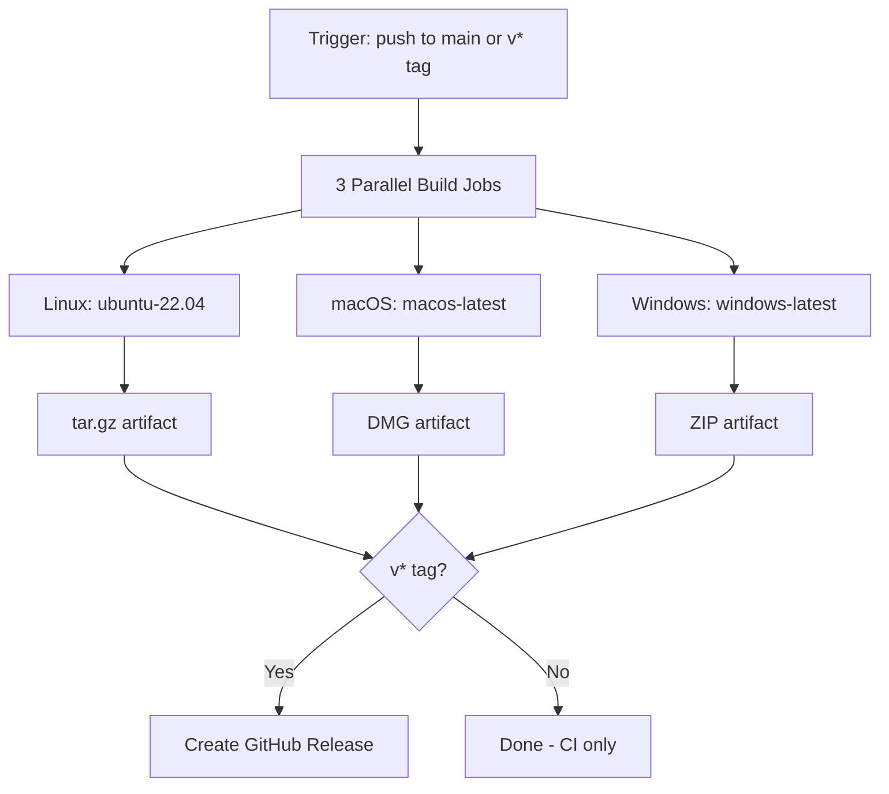
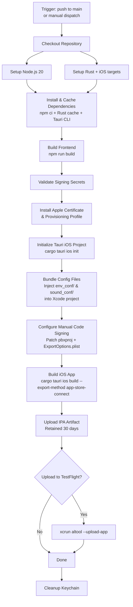
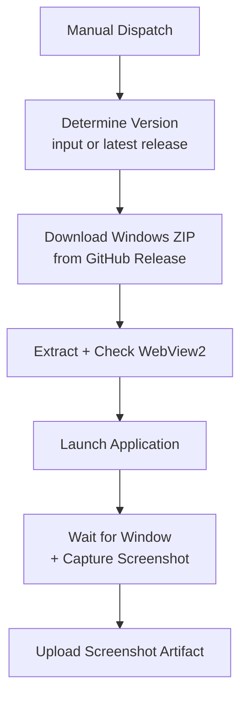

# CI/CD Workflows

## Overview

Three workflows automate building, releasing, and testing across all platforms:

| Workflow | File | Trigger | Purpose |
|----------|------|---------|---------|
| Desktop Build | `desktop-build.yml` | Push to `main`, `v*` tag | CI build + GitHub Release (Linux, macOS, Windows) |
| iOS Build | `ios-build.yml` | Push to `main` (when app files change) | TestFlight build |
| Windows Smoke Test | `windows-smoke-test.yml` | Manual dispatch | Download + launch + screenshot on real Windows |

## Unified Versioning

Both desktop and iOS read from the same `tauri.conf.json` version. The release script (`scripts/desktop-release.py`) manages versioning:

- **`make release`** — Bumps version, commits, creates `v*` tag, pushes. The tag triggers `desktop-build.yml`; the push triggers `ios-build.yml`. Both platforms build from one command.
- **`make release-ios`** — Bumps version, commits, pushes to main **without** a tag. Only `ios-build.yml` triggers (for iOS-only TestFlight iterations).

## Desktop Build (`desktop-build.yml`)

Builds the Tauri app for Linux, macOS, and Windows. On tag pushes, creates a GitHub Release with all platform binaries.

### Triggers

| Trigger | Condition | Result |
|---------|-----------|--------|
| Push to `main` | Always | CI build (compile + test, no release) |
| Push `v*` tag | Always | Full build + GitHub Release with binaries |
| Manual dispatch | Via GitHub Actions UI | CI build |

Concurrent builds on the same ref are cancelled automatically.

### Platform Jobs

| Platform | Runner | Output |
|----------|--------|--------|
| Linux | `ubuntu-22.04` | `immerse-yourself-linux-x86_64.tar.gz` |
| macOS | `macos-latest` | `Immerse.Yourself_X.Y.Z_aarch64.dmg` |
| Windows | `windows-latest` | `immerse-yourself-windows-x86_64.zip` |

### Release Job

Only runs on `v*` tag pushes. Downloads all 3 platform artifacts and creates a GitHub Release with permanent download links.

### Pipeline Flow



---

## iOS Build (`ios-build.yml`)

Builds the Immerse Yourself Tauri app for iOS, signs it with an Apple distribution certificate, and uploads to TestFlight.

### Triggers

| Trigger | Condition |
|---------|-----------|
| Push to `main` | When files change in `rust/immerse-tauri/`, `rust/immerse-core/`, `env_conf/`, `sound_conf/`, or this workflow |
| Manual dispatch | Via GitHub Actions UI, with optional TestFlight upload toggle |

Concurrent builds on the same branch are cancelled automatically.

### Required GitHub Secrets

| Secret | Description |
|--------|-------------|
| `APPLE_TEAM_ID` | Apple Developer Team ID |
| `APPLE_CERTIFICATE_P12` | Base64-encoded iOS distribution certificate (.p12) |
| `APPLE_CERTIFICATE_PASSWORD` | Password for the .p12 certificate |
| `APPLE_PROVISIONING_PROFILE` | Base64-encoded App Store provisioning profile (.mobileprovision) |
| `APPLE_ID` | Apple ID email (for TestFlight upload) |
| `APPLE_APP_SPECIFIC_PASSWORD` | App-specific password from appleid.apple.com (for TestFlight upload) |

Configure these in the repository's **Settings > Secrets and variables > Actions**.

### Pipeline Flow



### Build Details

- **Runner**: `macos-latest`
- **Node.js**: v20
- **Rust targets**: `aarch64-apple-ios`, `aarch64-apple-ios-sim`
- **Caching**: Rust dependencies, Tauri CLI binary, and npm packages are all cached between runs
- **Config bundling**: YAML files from `env_conf/` and `sound_conf/` are injected into the Xcode project via pbxproj manipulation, since Tauri's `bundle.resources` does not reliably work on iOS
- **Signing**: Manual code signing with injected certificate and provisioning profile
- **Output**: IPA artifact saved for 30 days, downloadable from the Actions run page

### Prerequisites

- Apple Developer Program membership ($99/year)
- App ID registered in App Store Connect (`com.peterlesko.immerseyourself`)
- iOS Distribution certificate exported as .p12
- App Store provisioning profile linked to the App ID
- All secrets added to the GitHub repository

---

## Windows Smoke Test (`windows-smoke-test.yml`)

Downloads a release build, launches it on a real Windows runner, verifies it starts successfully, and captures a screenshot.

### Triggers

| Trigger | Condition |
|---------|-----------|
| Manual dispatch | Via GitHub Actions UI or `make test-windows`, with optional version input |

### Usage

```bash
make test-windows              # Test latest release
make test-windows VERSION=v0.3.25  # Test a specific version
make test-windows-status       # Check run status
make test-windows-screenshot   # Download screenshot from latest completed run
```

### Pipeline Flow



### Build Details

- **Runner**: `windows-latest`
- **Input**: Release tag (e.g., `v0.3.25`) or latest release if omitted
- **Checks**: WebView2 runtime presence, application startup, window rendering
- **Output**: Screenshot artifact downloadable from the Actions run page
