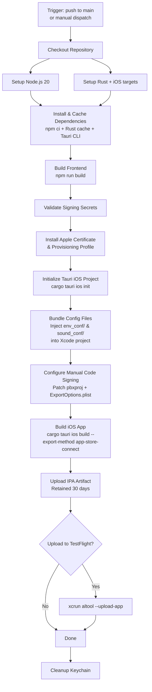

# CI/CD Workflows

## iOS Build (`ios-build.yml`)

Builds the Immerse Yourself Tauri app for iOS, signs it with an Apple distribution certificate, and optionally uploads to TestFlight.

### Triggers

| Trigger | Condition |
|---------|-----------|
| Push to `main` | When files change in `rust/immerse-tauri/`, `rust/immerse-core/`, `env_conf/`, `sound_conf/`, or this workflow |
| Manual dispatch | Via GitHub Actions UI, with optional TestFlight upload toggle |

Concurrent builds on the same branch are cancelled automatically.

### Required GitHub Secrets

| Secret | Description |
|--------|-------------|
| `APPLE_TEAM_ID` | Apple Developer Team ID |
| `APPLE_CERTIFICATE_P12` | Base64-encoded iOS distribution certificate (.p12) |
| `APPLE_CERTIFICATE_PASSWORD` | Password for the .p12 certificate |
| `APPLE_PROVISIONING_PROFILE` | Base64-encoded App Store provisioning profile (.mobileprovision) |
| `APPLE_ID` | Apple ID email (for TestFlight upload) |
| `APPLE_APP_SPECIFIC_PASSWORD` | App-specific password from appleid.apple.com (for TestFlight upload) |

Configure these in the repository's **Settings > Secrets and variables > Actions**.

### Pipeline Flow

### Build Details

- **Runner**: `macos-latest`
- **Node.js**: v20
- **Rust targets**: `aarch64-apple-ios`, `aarch64-apple-ios-sim`
- **Caching**: Rust dependencies, Tauri CLI binary, and npm packages are all cached between runs
- **Config bundling**: YAML files from `env_conf/` and `sound_conf/` are injected into the Xcode project via pbxproj manipulation, since Tauri's `bundle.resources` does not reliably work on iOS
- **Signing**: Manual code signing with injected certificate and provisioning profile
- **Output**: IPA artifact saved for 30 days, downloadable from the Actions run page

### Prerequisites

- Apple Developer Program membership ($99/year)
- App ID registered in App Store Connect (`com.peterlesko.immerseyourself`)
- iOS Distribution certificate exported as .p12
- App Store provisioning profile linked to the App ID
- All secrets added to the GitHub repository
