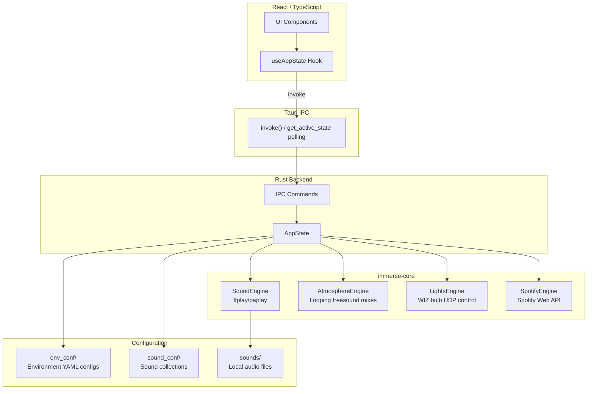

# Immerse Yourself

[](https://sonarcloud.io/summary/new_code?id=indubitablygregarious_immerse-yourself)

An open-source interactive ambient environment system that transforms your space with synchronized music, smart lighting, and sound effects. Built for tabletop gaming (D&D, Pathfinder), ambient workspaces, or just setting the mood.


## What It Does

Immerse Yourself creates immersive environments by controlling:
- **Spotify playback** -- Context-specific playlists for each scene
- **WIZ smart lights** -- Dynamic color animations and effects synchronized to the environment
- **Sound effects** -- Ambient audio triggers for scene transitions
- **Atmosphere loops** -- Layered ambient sound mixes from freesound.org

## Architecture

Built with **Tauri 2.x** (Rust backend + React TypeScript frontend), providing native desktop performance with a modern web UI.



## Features

- **Category sidebar** with environment and sound categories, active badges showing what's playing
- **Environment grid** with scalable buttons, emoji icons, feature badges, and keyboard shortcuts
- **Search** (Ctrl+L) -- fuzzy search across names, descriptions, tags, and icons
- **Time-of-day selector** -- Morning / Daytime / Afternoon / Evening with keyboard shortcuts 1-4
- **Loop sounds** with individual volume sliders (toggle on/off, mix freely)
- **Three stop buttons**: Stop Lights (red), Stop Sound (orange, Spacebar), Stop Atmosphere (green)
- **Settings dialog** (Ctrl+,) -- Appearance, Spotify credentials, WIZ bulb IPs, downloads, About & Credits
- **Keyboard shortcuts**: Q-L for environment buttons, 1-4 for time, Ctrl+PgUp/PgDn for categories
- **Dark mode** -- Light, Dark, or System theme
- **Lighting preview** -- real-time color gradient of active light groups
- **About & Credits** -- attribution panel listing all CC-BY sound sources with links
- **Bundled sounds** -- all atmosphere sounds ship pre-packaged with the app, no runtime downloads
- **Exit cleanup** -- stops engines and sets lights to warm white

## Requirements

### Hardware (Optional)
- **WIZ smart bulbs** (3+ recommended) -- for lighting effects
  - Backdrop bulbs (ambiance), Overhead bulbs (main lighting), Battlefield bulbs (combat scenes)
- **Spotify Premium account** -- for music playback

*The app works without either! Sound effects and atmosphere loops play independently.*

### Software
- **Rust 1.89+** (Makefile handles version automatically)
- **Node.js 18+** and npm
- **ffplay** (from ffmpeg) -- for sound playback
- **pactl** (PulseAudio) -- for volume control on Linux

## Installation

### 1. Clone the repository
```bash
git clone https://github.com/indubitablygregarious/immerse-yourself.git
cd immerse-yourself
```

### 2. Build and run
```bash
# Development mode with hot reload
make dev

# Or build a production binary
make build
make run
```

The Makefile handles Rust toolchain version management automatically. **Never run `cargo` commands directly** -- they will fail with version errors.

### 3. Configure (optional)

Launch the app and go to **Settings** (Ctrl+,):

**Spotify** (for music playback):
1. Go to [Spotify Developer Dashboard](https://developer.spotify.com/dashboard)
2. Create a new app and note your **Client ID** and **Client Secret**
3. Add `http://127.0.0.1:8888/callback` as a Redirect URI
4. Enter credentials in Settings > Spotify panel

**WIZ Bulbs** (for lighting effects):
1. Open Settings > WIZ Bulbs panel
2. Click "Discover Bulbs" to scan your network
3. Assign discovered IPs to backdrop/overhead/battlefield groups

## Adding Content

The app ships with all atmosphere sounds pre-packaged and a starter set of environments. Add your own or install content packs:

### Option 1: Direct (for development)

Place YAML config files directly in:
- `env_conf/` -- Environment configs (see `env_conf/README.md` for schema)
- `sound_conf/` -- Sound variation collections
- `sounds/` -- Audio files (.wav, .mp3, .ogg, .opus, .flac)

### Option 2: User Content Directory (recommended)

Place content in your platform-specific user content directory (auto-created on first launch):

- **Linux**: `~/.local/share/com.peterlesko.immerseyourself/`
- **macOS**: `~/Library/Application Support/com.peterlesko.immerseyourself/`

Each has `env_conf/`, `sound_conf/`, and `sounds/` subdirectories. Open via **Settings > User Content > Open Folder**.

Content packs (premium environment collections) can be installed by extracting them into the user content directory.

### Creating a Custom Environment

```yaml
name: "My Scene"
category: "tavern"
description: "A cozy corner of the world"
icon: "🎮"

metadata:
  tags: ["custom", "cozy"]
  intensity: "low"

engines:
  sound:
    enabled: true
    file: "sounds/door.wav"

  spotify:
    enabled: true
    context_uri: "spotify:playlist:YOUR_PLAYLIST_ID"

  atmosphere:
    enabled: true
    mix:
      - url: "https://freesound.org/people/user/sounds/12345/"
        volume: 70
        name: "Crackling Fire"

  lights:
    enabled: true
    animation:
      cycletime: 12
      groups:
        backdrop:
          type: rgb
          rgb: { base: [180, 120, 60], variance: [20, 15, 10] }
          brightness: { min: 100, max: 200 }
```

See `env_conf/README.md` for the complete schema.

## Usage

- Click any environment button to start it
- Press **Q, W, E, R...** keys for quick access (shown as badges on buttons)
- Press **Ctrl+L** to search environments
- Press **1-4** to change time of day (when variants are available)
- Press **Spacebar** to stop all sounds
- Press **Escape** to clear search
- **Lights environments** replace each other; **sound-only buttons** overlay on running lights

## Build Commands

```bash
make help       # Show all available commands
make dev        # Start Tauri dev server with hot reload
make dev-full   # Dev with full content from private repo
make build      # Build production application
make run        # Run pre-built binary
make test       # Run Rust tests
make check      # Type-check without building
make clean      # Remove build artifacts
make release             # Cut a release — builds desktop + iOS (bump, tag, push, monitor)
make release-dry-run     # Preview what a release would do
make release-ios         # iOS TestFlight only (bump, push to main, no tag)
make release-ios-dry-run # Preview what an iOS-only release would do
make lint                # Lint Python scripts with ruff
```

### Releases

Both desktop and iOS platforms read from the same version in `tauri.conf.json`. A single `make release` triggers both:
- The `v*` tag triggers `desktop-build.yml` — builds Linux, macOS, and Windows binaries, creates a GitHub Release
- The push to `main` triggers `ios-build.yml` — builds and uploads to TestFlight

For iOS-only iterations (no desktop release), use `make release-ios` — it pushes to main without a tag.

### iOS Builds (macOS only)

```bash
make ios-setup   # Install prerequisites
make ios-dev     # Run on iOS Simulator with hot reload
make ios-build   # Build for iOS (debug)
make ios-release # Build release IPA for TestFlight
```

### Windows Smoke Test

```bash
make test-windows              # Trigger smoke test on GitHub Actions (real Windows)
make test-windows VERSION=TAG  # Test a specific release version
make test-windows-status       # Check smoke test run status
make test-windows-screenshot   # Download screenshot from latest completed run
```

## Project Structure

```
immerse-yourself/
├── rust/
│   ├── immerse-core/           # Shared Rust library
│   │   └── src/
│   │       ├── config/         # YAML config loading and validation
│   │       ├── engines/        # Sound, Spotify, Lights, Atmosphere engines
│   │       └── download_queue.rs
│   └── immerse-tauri/          # Tauri desktop application
│       ├── src/                # Rust backend (state, commands, init)
│       └── ui/                 # React TypeScript frontend
│           └── src/
│               ├── components/ # UI components
│               ├── hooks/      # useAppState (Tauri IPC)
│               └── types/      # TypeScript interfaces
├── env_conf/                   # Environment YAML configs
├── sound_conf/                 # Sound variation collections
├── sounds/                     # Local sound effect files
├── freesound_sounds/           # Bundled free-tier atmosphere sounds + attribution.json
├── scripts/                    # Release automation (desktop-release.py)
├── .github/workflows/          # CI/CD (desktop-build, ios-build, windows-smoke-test)
├── devlog/                     # Development diary
├── tests/                      # E2E tests and screenshot automation
├── Makefile                    # Build commands (always use this)
└── CLAUDE.md                   # Development guidance for Claude Code
```

## Troubleshooting

### Music not playing
- Check Settings > Spotify for credentials
- Click an environment with music -- browser opens for OAuth authorization
- If still failing, delete `.cache` file and re-authorize

### Lights don't respond
- Check Settings > WIZ Bulbs for IP addresses
- Click "Discover Bulbs" to scan your network
- Verify bulbs are powered on and connected to WiFi

### No sound effects
- Install ffmpeg: `sudo apt install ffmpeg`
- Ensure sound files exist in `sounds/` or user content directory

### Build fails
- Never run `cargo` directly -- always use `make` commands
- The Makefile handles Rust 1.89 version requirement automatically

## Contributing

Contributions are welcome! Please:
1. Fork the repository
2. Create a feature branch
3. Make your changes
4. Run `make check`, `make test`, and `make lint`
5. Submit a pull request

## Credits

Built with:
- [Tauri 2.x](https://tauri.app/) -- Desktop app framework (Rust + Web)
- [React](https://react.dev/) -- Frontend UI library
- [TypeScript](https://www.typescriptlang.org/) -- Type-safe JavaScript
- [Vite](https://vitejs.dev/) -- Frontend build tool
- [freesound.org](https://freesound.org/) -- Ambient sound sources (CC-BY and CC0)

### Sound Attribution

Bundled atmosphere sounds are sourced from [freesound.org](https://freesound.org/) under Creative Commons licenses. Full attribution for all CC-BY sounds is available in `ATTRIBUTION.md` and in-app via **Settings > About & Credits**.

## License

MIT -- see [LICENSE](LICENSE)
