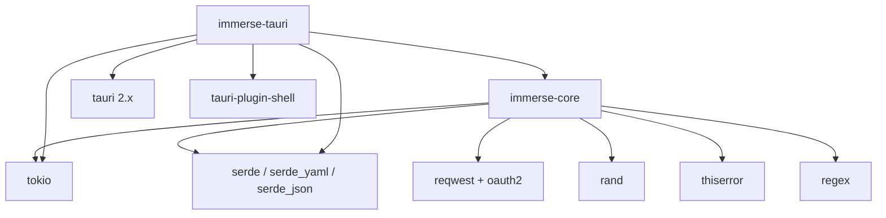

# Rust Workspace

Cargo workspace containing the Rust crates for the Immerse Yourself ambient environment system.

## Crates

| Crate | Description |
|-------|-------------|
| [`immerse-core`](./immerse-core/) | Shared core library: config loading, engine implementations, download queue |
| [`immerse-tauri`](./immerse-tauri/) | Tauri 2.x desktop application (Rust backend + React TypeScript frontend) |

## Crate Dependency Graph



## Building

**IMPORTANT**: The system default is Rust 1.75, but Tauri requires Rust 1.89. Never run `cargo build`, `cargo test`, or `cargo check` directly -- they will fail with version errors. Always use the Makefile targets from the project root:

```bash
make dev        # Start Tauri dev server with hot reload
make build      # Build production Tauri application
make test       # Run Rust tests for both crates
make check      # Type-check without building
```

These targets create a wrapper that uses the correct Rust toolchain version.

## Workspace Configuration

Shared settings are defined in the root `Cargo.toml`:

- **Edition**: 2021
- **Resolver**: 2
- Common dependencies (tokio, serde, reqwest, etc.) are declared as workspace dependencies and inherited by each crate.
