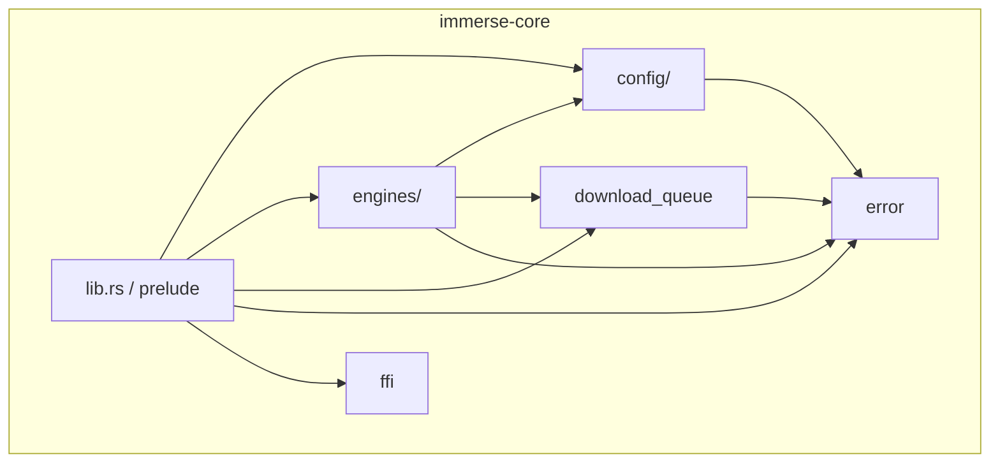
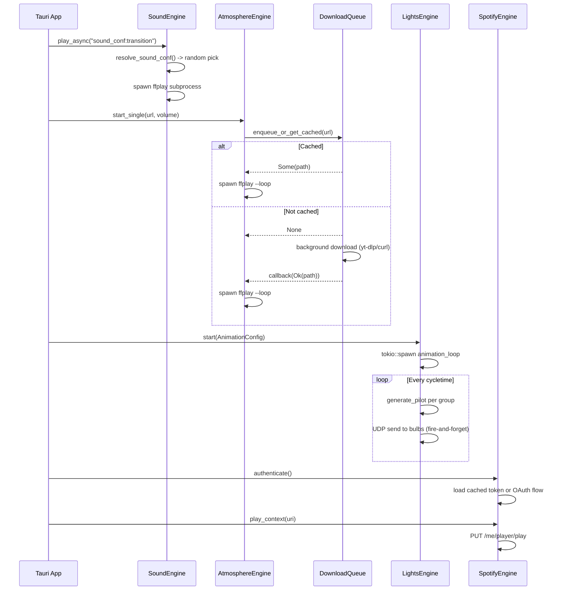

# immerse-core

Shared core library for the Immerse Yourself ambient environment system. Provides YAML config loading/validation, audio engines, smart light control, Spotify integration, and a background download queue for freesound.org sounds.

## Module Architecture



## Modules

### `config/` -- Configuration Loading and Validation

Loads 340+ environment YAML files, validates them, and provides typed Rust structs. Handles time-of-day variant resolution and caching.

Key types: `EnvironmentConfig`, `EnginesConfig`, `AnimationConfig`, `LightGroupConfig`, `TimeOfDay`

See [`src/config/README.md`](./src/config/README.md) for details.

### `engines/` -- Audio, Lights, and Spotify Engines

Four engine implementations for controlling the environment:

- **SoundEngine** -- One-shot and async audio playback via ffplay/paplay/aplay
- **AtmosphereEngine** -- Looping ambient sound mixes with volume control and fade-out
- **LightsEngine** -- WIZ smart bulb animation via UDP
- **SpotifyEngine** -- Spotify Web API playback control with OAuth

See [`src/engines/README.md`](./src/engines/README.md) for details.

### `download_queue` -- Background Download Queue

Manages async downloads of freesound.org sounds. Downloads are processed one at a time in a background thread. Supports caching, status tracking, and callbacks on completion.

Key types: `DownloadQueue`, `DownloadStatus`, `DownloadCallback`

### `error` -- Error Types

Centralized error enum using `thiserror`. Covers config, sound, Spotify, lights, atmosphere, daemon, and I/O errors.

### `ffi` -- Foreign Function Interface

FFI layer for Swift/iOS interop, exposing core functionality to non-Rust consumers.

## Engine Lifecycle



## Key Types

| Type | Module | Purpose |
|------|--------|---------|
| `EnvironmentConfig` | config | Complete environment definition from YAML |
| `ConfigLoader` | config | Discovers, loads, validates, and caches configs |
| `ConfigValidator` | config | Validates config constraints (brightness ranges, URIs, etc.) |
| `TimeOfDay` | config | Enum: Morning, Daytime, Afternoon, Evening |
| `SoundEngine` | engines | Plays audio files via system subprocess |
| `AtmosphereEngine` | engines | Manages looping ambient sounds with fade/duration |
| `LightsEngine` | engines | Controls WIZ bulbs with async animation loop |
| `SpotifyEngine` | engines | Spotify Web API client with OAuth token management |
| `DownloadQueue` | download_queue | Background download manager for freesound.org |

## Building

Always use Make targets from the project root (never `cargo` directly):

```bash
make tauri-test     # Run tests
make tauri-check    # Type-check
```
