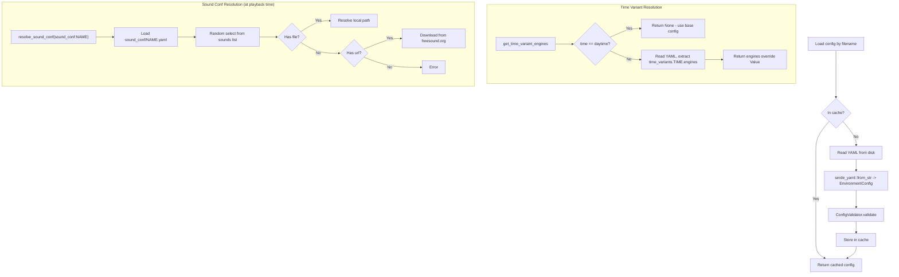

# Config

Configuration loading, type definitions, and validation for environment YAML files.

## Pipeline

```mermaid
graph LR
    YAML["YAML Files<br/>(env_conf/*.yaml)"] --> L[loader.rs<br/>ConfigLoader]
    L -->|deserialize| T[types.rs<br/>EnvironmentConfig]
    T --> V[validator.rs<br/>ConfigValidator]
    V -->|valid| CACHE[In-memory Cache<br/>(HashMap)]
    V -->|invalid| ERR[Error]
```

## Config Resolution Flow



## Modules

### `types.rs` -- Type Definitions

Core types deserialized from YAML:

| Type | Description |
|------|-------------|
| `EnvironmentConfig` | Top-level config: name, category, icon, metadata, engines, time_variants |
| `EnginesConfig` | Container for optional sound, spotify, atmosphere, lights configs |
| `SoundConfig` | Sound file path or `sound_conf:` reference, loop flag |
| `SpotifyConfig` | Spotify context URI and optional offset |
| `AtmosphereConfig` | Mix of ambient sounds with volume, duration, fade settings |
| `LightsConfig` | Enabled flag + optional `AnimationConfig` |
| `AnimationConfig` | Cycletime + HashMap of named `LightGroupConfig` entries |
| `LightGroupConfig` | Tagged enum: Rgb, Scene, Off, InheritBackdrop, InheritOverhead |
| `TimeOfDay` | Enum: Morning, Daytime (default), Afternoon, Evening |
| `TimeVariant` | Optional config reference + flattened override map |
| `Metadata` | Tags, intensity, suitable_for, loop flag |

`EnvironmentConfig` provides helper methods: `has_lights()`, `has_spotify()`, `is_sound_only()`, `is_loop_sound()`, `is_sound_effect()`.

### `loader.rs` -- Config Loading and Discovery

`ConfigLoader` provides:
- **load(filename)** -- Load a single config with caching and validation
- **discover_all()** -- Find all `.yaml`/`.yml` files in the config directory
- **load_all()** -- Load everything, grouped by category, sorted by name

Time variant helpers (standalone functions):
- `has_time_variants(config_dir, base_name)` -- Quick check for `time_variants:` key
- `get_available_times(config_dir, base_name)` -- Returns available times in canonical order
- `get_time_variant_engines(config_dir, base_name, time)` -- Extracts the engines override for a specific time
- `resolve_time_variant(base_name, time)` -- Generates filename for legacy file-based variants

Time variant resolution: "daytime" uses the base config as-is. Other times deep-merge overrides from `time_variants.{time}.engines` into the base config.

### `validator.rs` -- Config Validation

`ConfigValidator` checks:
- Name and category are non-empty
- Animation cycletime is positive
- Brightness min does not exceed max (for both Rgb and Scene groups)
- Sound file path is non-empty when sound is enabled
- Spotify URI starts with `spotify:` when Spotify is enabled
