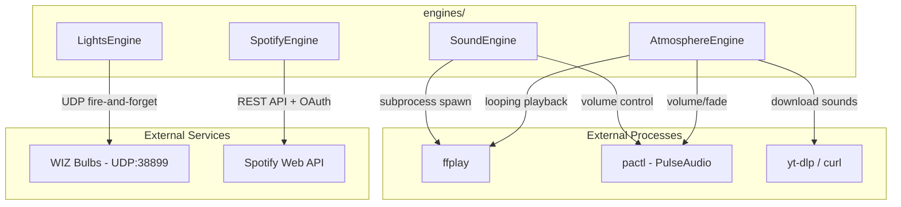

# Engines

Engine implementations for controlling sound, lights, Spotify, and atmosphere playback.

## Architecture

## Engine Overview

### SoundEngine (`sound.rs`)

Plays one-shot audio files using system audio players. Detects the best available player at startup in preference order: ffplay, paplay, aplay.

- **play()** -- Synchronous (blocking) playback
- **play_async()** / **play_async_with_volume()** -- Non-blocking, spawns subprocess
- **play_async_with_callback()** -- Non-blocking with completion notification
- **stop_all()** -- Kills all tracked child processes
- **resolve_sound_conf()** -- Resolves `sound_conf:` references by randomly selecting from a YAML-defined collection

Sets `PULSE_PROP_application.name=immerse-sfx` to isolate PulseAudio stream-restore from atmosphere sounds. Uses `pactl set-sink-input-volume` to set per-process volume after a 200ms delay.

### AtmosphereEngine (`atmosphere.rs`)

Manages looping ambient sounds from freesound.org URLs. Sounds are downloaded on demand via the `DownloadQueue` and played with `ffplay -loop 0`.

- **start_single()** / **start_single_with_options()** -- Start a looping sound with optional fade and max duration
- **stop_single()** / **stop_all()** -- Stop individual or all sounds
- **set_volume()** -- Adjust volume via PulseAudio without restarting
- **pre_download()** -- Queue a download without starting playback

Uses a generation counter (`AtomicU64`) to invalidate pending download callbacks when the environment changes, preventing sounds from a previous environment from starting after a switch.

Duration and fade behavior:
- `max_duration` only: hard stop after N seconds
- `fade_duration` only: immediate gradual fade over N seconds, then stop
- Both set: wait `(max_duration - fade_duration)` seconds, then fade out over `fade_duration` seconds

Sets `PULSE_PROP_application.name=immerse-atmosphere` for PulseAudio isolation.

### LightsEngine (`lights.rs`)

Controls WIZ smart bulbs via UDP (port 38899) with animated color/scene cycling.

- **start()** -- Spawns a tokio background task running the animation loop
- **stop()** -- Sets stop flag and aborts the task
- **update_config()** -- Hot-swaps animation config without stopping
- **set_warm_white()** -- Sets all bulbs to warm white (used on app exit)

Animation loop generates `WizPilot` JSON commands per group each cycle:
- **Rgb** groups: base color + random variance + brightness range + optional flash
- **Scene** groups: WIZ scene ID + random speed + brightness
- **InheritBackdrop/InheritOverhead**: copies pilot from another group
- **Off**: sets RGB to 0,0,0 with 0 brightness

Commands are sent fire-and-forget (non-blocking UDP send, errors ignored).

Bulb configuration is loaded from `.wizbulb.ini` with three groups: backdrop, overhead, battlefield.

### SpotifyEngine (`spotify.rs`)

Controls Spotify playback via the Web API with full OAuth 2.0 flow.

- **authenticate()** -- Loads cached token, refreshes if expired, or runs full OAuth browser flow
- **play_context()** -- Plays a playlist/album URI; auto-retries with device transfer if no active device
- **pause()** -- Pauses playback
- **get_devices()** -- Lists available Spotify Connect devices
- **transfer_playback()** -- Moves playback to a specific device

Helper functions (not on the engine struct):
- `is_spotify_running()` -- Checks if Spotify process is active (platform-specific)
- `start_spotify()` -- Launches the Spotify desktop app
- `is_spotify_in_path()` -- Checks if `spotify` command is available

OAuth callback uses a local TCP listener on the redirect URI port (default 8888). Tokens are cached to disk as JSON and refreshed automatically.

## Engine Interactions

Engines are independent and do not directly reference each other. The Tauri app layer (`immerse-tauri`) coordinates them:

- Starting an environment may trigger all four engines simultaneously
- Sound-only configs play sound without affecting running lights
- `AtmosphereEngine` and `SoundEngine` both use ffplay but with different PulseAudio application names to avoid volume cross-contamination
- Switching environments stops atmosphere (with generation invalidation) and updates lights (hot-swap) without flicker
