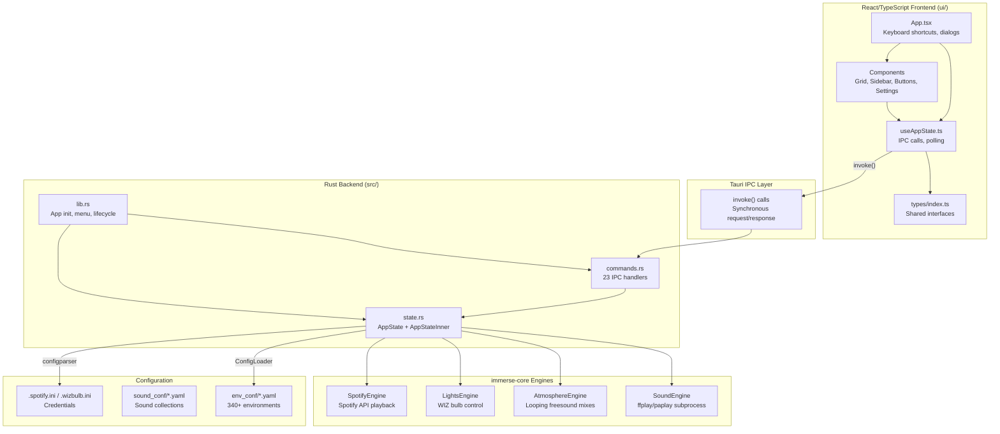
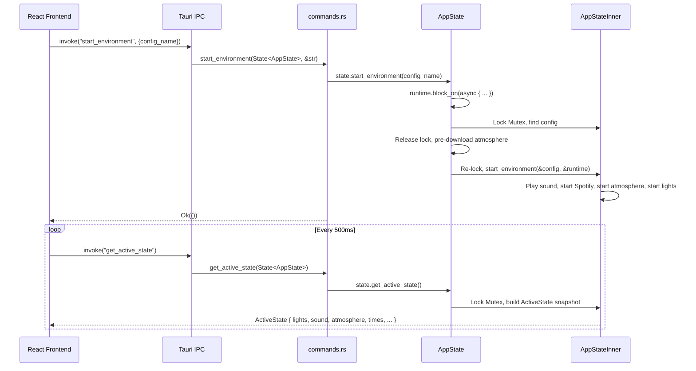

# Immerse Yourself -- Tauri Application

Tauri 2.x desktop application for the Immerse Yourself ambient environment system. Combines a Rust backend for state management and engine coordination with a React/TypeScript frontend for the user interface.

**Version:** 0.3.1 | **Identifier:** `com.peterlesko.immerseyourself`

## Architecture



## State Management



The frontend polls `get_active_state` to reactively update the UI. The `ActiveState` struct captures a snapshot of all running engines, active configs, download status, and available time variants.

## Project Structure

```
rust/immerse-tauri/
├── src/
│   ├── lib.rs          # App builder, native menu, lifecycle events
│   ├── commands.rs     # 23 IPC command handlers (thin wrappers)
│   └── state.rs        # AppState, AppStateInner, all business logic
├── ui/                 # React/TypeScript frontend (Vite)
│   ├── src/
│   │   ├── App.tsx             # Root component, keyboard shortcuts
│   │   ├── components/         # 13 UI components
│   │   ├── hooks/useAppState.ts  # IPC hook with polling
│   │   └── types/index.ts     # TypeScript interfaces
│   └── dist/           # Build output (frontendDist)
├── Cargo.toml          # Rust dependencies (tauri 2, immerse-core, tokio)
└── tauri.conf.json     # Window config, bundling, resource mapping
```

## IPC Commands

| Command | Purpose | Return Type |
|---------|---------|-------------|
| `get_categories` | Ordered category list (env first, then sounds) | `Vec<String>` |
| `get_environments` | Configs for a category (filtered by type) | `Vec<EnvironmentConfig>` |
| `get_all_configs` | All configs grouped by category | `HashMap` |
| `start_environment` | Start an environment (with pre-download) | `Result<()>` |
| `start_environment_with_time` | Start with time variant | `Result<()>` |
| `toggle_loop_sound` | Toggle a loop sound on/off by URL | `Result<bool>` |
| `set_volume` | Set volume for an atmosphere URL | `Result<()>` |
| `stop_lights` / `stop_sounds` / `stop_atmosphere` | Stop individual engine groups | varies |
| `search_configs` | Fuzzy search across all metadata fields | `Vec<EnvironmentConfig>` |
| `get_active_state` | Full UI state snapshot (polled) | `ActiveState` |
| `get_available_times` | Time variants for a config | `AvailableTimes` |
| `set_current_time` | Set time of day (morning/daytime/afternoon/evening) | `Result<()>` |
| `trigger_startup` | Auto-start "Startup" or "Travel" on launch | `Option<String>` |
| `get_spotify_config` / `save_spotify_config` | Read/write Spotify credentials | struct / `Result<()>` |
| `get_wizbulb_config` / `save_wizbulb_config` | Read/write bulb IPs | struct / `Result<()>` |
| `get_app_settings` / `save_app_settings` | Read/write settings.ini | struct / `Result<()>` |
| `discover_bulbs` | UDP broadcast to find WIZ bulbs | `Result<Vec<String>>` |

## Category System

Categories are split into three groups with fixed ordering:

- **Environment categories** (shown first): tavern, town, interiors, travel, forest, coastal, dungeon, combat, spooky, relaxation, celestial
- **Sound categories** (shown after separator): nature, water, fire, wind, storm, crowd, footsteps, reactions, combat_sfx, ambient, creatures, misc, freesound, sounds
- **Hidden categories** (never shown): hidden (contains startup environments)

Environment categories filter out all sound effects. Sound categories show only sound effects. Virtual loop configs are auto-generated from atmosphere mix URLs and placed in the appropriate sound category using keyword matching.

## Build Commands

Always use the Makefile from the project root -- never run `cargo build` directly (requires Rust 1.89 wrapper):

```bash
make tauri-dev      # Start dev server with hot reload
make tauri-build    # Production build (deb, appimage)
make tauri-test     # Run Rust tests
make tauri-check    # Type-check without building
```

## Key Dependencies

- **tauri 2** + **tauri-plugin-shell** -- Desktop framework and shell access
- **immerse-core** -- Shared Rust library (config loading, all engines)
- **tokio** -- Async runtime for engine coordination
- **configparser** -- INI file read/write for settings
- **serde / serde_yaml** -- Config serialization
