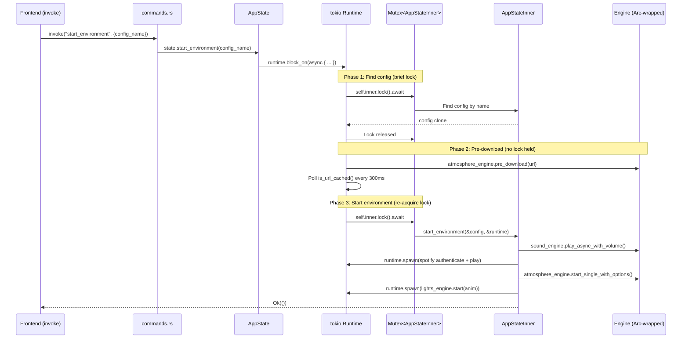

# Rust Backend (`src/`)

The Tauri backend consists of three files that handle application initialization, IPC command routing, and all state management including engine coordination.

## File Overview

### `lib.rs` -- Application Entry Point

Sets up the Tauri application:

- Initializes `tracing_subscriber` for structured logging (INFO level default, configurable via `RUST_LOG`)
- Resolves the Tauri resource directory for bundled `env_conf/` and `sound_conf/` files
- Creates `AppState` and registers it via `app.manage()`
- Builds the native **File** menu (desktop only): Settings item + Quit (Ctrl+Q)
- Registers all 23 IPC command handlers via `tauri::generate_handler!`
- Handles menu events: Settings opens via `window.eval()` calling `window.__openSettings()`, Quit triggers `state.cleanup()`
- Handles lifecycle events: `CloseRequested` and `ExitRequested` both call `state.cleanup()` to stop engines and set lights to warm white

### `commands.rs` -- IPC Command Handlers

Thin wrapper functions decorated with `#[tauri::command]` that delegate to `AppState` methods. Each command receives `State<AppState>` (Tauri's dependency injection) and forwards to the corresponding method. The only exception is `discover_bulbs`, which is `async` and calls a standalone function directly.

All commands are synchronous from the frontend's perspective -- Tauri's IPC serializes the call, the Rust side uses `runtime.block_on()` internally, and the result is returned as JSON.

### `state.rs` -- State Management and Business Logic

Contains all application state and the bulk of the business logic (~2000 lines).

## Command Handling Flow



## AppState Architecture

`AppState` is the thread-safe outer wrapper:

```rust
pub struct AppState {
    inner: Mutex<AppStateInner>,   // tokio::sync::Mutex for async lock
    runtime: Runtime,               // Dedicated tokio Runtime
}
```

Every public method follows the `block_on` pattern: `self.runtime.block_on(async { lock inner, do work })`. This bridges Tauri's synchronous command handlers with the async engine APIs.

`AppStateInner` holds all mutable state:

| Field | Type | Purpose |
|-------|------|---------|
| `config_loader` | `ConfigLoader` | Loads and caches YAML configs |
| `configs_by_category` | `HashMap<String, Vec<EnvironmentConfig>>` | All loaded configs |
| `active_lights_config` | `Option<String>` | Currently running lights environment name |
| `active_atmosphere_urls` | `HashSet<String>` | URLs of playing atmosphere sounds |
| `atmosphere_volumes` | `HashMap<String, u8>` | Per-URL volume levels |
| `current_time` | `TimeOfDay` | Active time of day variant |
| `sound_engine` | `Arc<SoundEngine>` | One-shot sound playback |
| `lights_engine` | `Option<Arc<Mutex<LightsEngine>>>` | WIZ bulb control (None if unconfigured) |
| `atmosphere_engine` | `Arc<AtmosphereEngine>` | Looping freesound playback |
| `spotify_engine` | `Option<Arc<Mutex<SpotifyEngine>>>` | Spotify API (None if unconfigured) |

## Key Patterns

### Arc Wrapping for Engines

Engines that need async access from spawned tasks are wrapped in `Arc<Mutex<>>`:
- `lights_engine` and `spotify_engine` use `Arc<Mutex<T>>` because they are `.lock().await`-ed inside `runtime.spawn()` blocks
- `sound_engine` and `atmosphere_engine` use `Arc<T>` (no Mutex) because their methods are internally thread-safe

### Lock Release During Downloads

The `start_environment` and `start_environment_with_time` methods use a three-phase pattern to avoid holding the Mutex during network I/O:
1. **Phase 1**: Lock briefly to find the config and identify uncached URLs
2. **Phase 2**: Release lock, pre-download atmosphere sounds (polling `is_url_cached` every 300ms, 60s timeout)
3. **Phase 3**: Re-acquire lock to actually start engines

This allows `get_active_state` polling to continue during downloads.

### Virtual Loop Config Generation

On startup, `generate_virtual_loop_configs()` scans all environment configs for freesound URLs in atmosphere mixes and creates synthetic `EnvironmentConfig` entries. These appear as toggleable loop sounds in the sidebar. Each virtual config is auto-categorized using keyword matching against `SOUND_CATEGORY_KEYWORDS` (12 categories, ~120 keywords).

### Project Root Discovery

`find_project_root()` searches for the `env_conf/` directory in this order:
1. Current working directory (desktop development)
2. Parent directories (up to 3 levels)
3. Tauri resource directory (bundled builds)
4. iOS bundle root (Xcode Copy Bundle Resources)
5. Executable directory (iOS .app bundle)
6. Fallback to resource dir or CWD

### Settings Persistence

Settings are stored in INI files using `configparser`:
- `.spotify.ini` -- Spotify API credentials (client_id, client_secret, etc.)
- `.wizbulb.ini` -- WIZ bulb IP addresses by group (backdrop, overhead, battlefield)
- `settings.ini` -- General settings (ignore_ssl_errors, spotify_auto_start)

The `update_settings_ini` helper loads, modifies, and rewrites individual settings without clobbering other sections.
