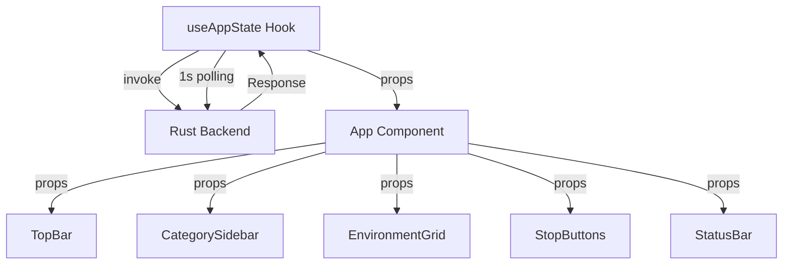
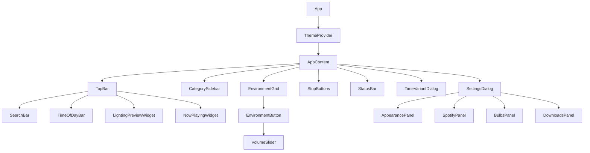
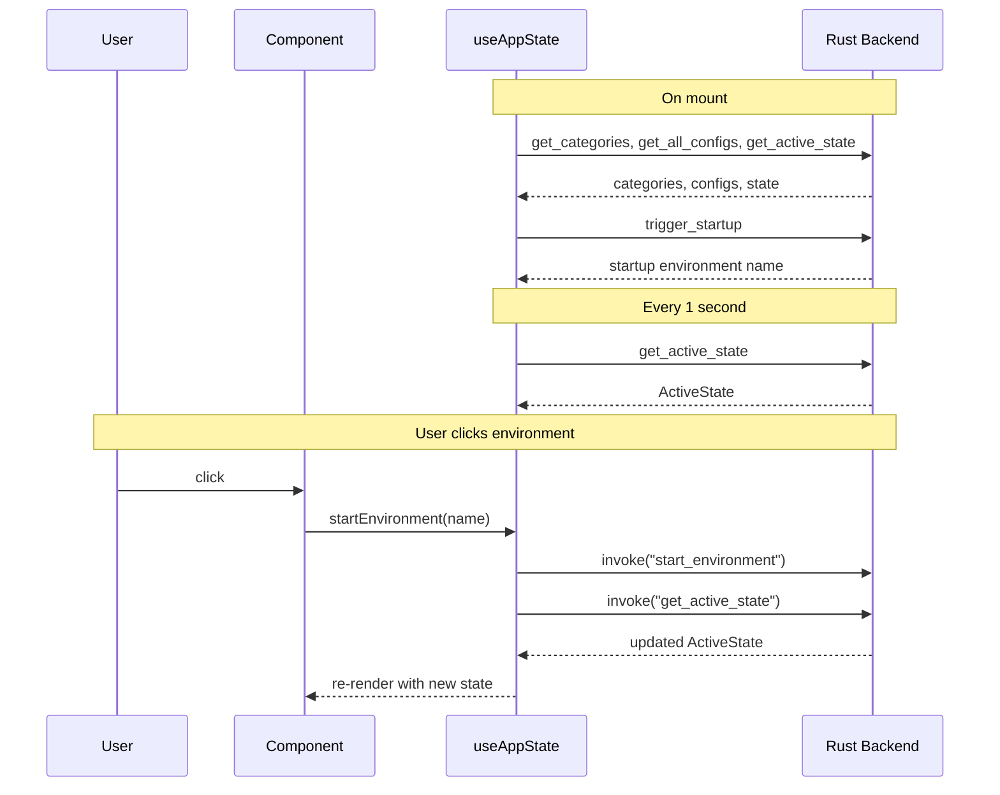

# Immerse Yourself - Tauri Frontend

React + TypeScript + Vite frontend for the Immerse Yourself Tauri application. This is the web UI layer that runs inside a Tauri webview, communicating with the Rust backend via IPC commands.

## Stack

- **React 18** with functional components and hooks
- **TypeScript 5** for type safety
- **Vite 5** for fast builds and hot module replacement
- **@tauri-apps/api 2.x** for Rust backend communication

## Project Structure

```
ui/
├── src/
│   ├── main.tsx                  # ReactDOM entry point
│   ├── App.tsx                   # Root component, keyboard shortcuts, layout
│   ├── components/               # UI components (see components/README.md)
│   ├── hooks/
│   │   └── useAppState.ts        # Central state hook with Tauri IPC
│   ├── contexts/
│   │   └── ThemeContext.tsx       # Light/dark/system theme provider
│   ├── types/
│   │   └── index.ts              # TypeScript interfaces matching Rust structs
│   ├── utils/
│   │   └── sceneColors.ts        # WIZ bulb scene ID to RGB mapping
│   └── styles/
│       └── globals.css           # Global styles and CSS variables
├── index.html                    # Vite entry HTML
├── package.json                  # Dependencies and scripts
├── tsconfig.json                 # TypeScript configuration
└── vite.config.ts                # Vite configuration
```

## Component Overview

| Component | Description |
|-----------|-------------|
| `App` | Root layout, global keyboard shortcuts, dialog state management |
| `TopBar` | Horizontal bar with search, time-of-day buttons, lighting preview, now-playing |
| `CategorySidebar` | Left sidebar listing environment and sound categories with active badges |
| `EnvironmentGrid` | Responsive grid of environment buttons with shortcut key assignment |
| `EnvironmentButton` | Individual environment/loop-sound button with badges, icon, volume slider |
| `StopButtons` | Footer with Stop Lights / Stop Sound / Stop Atmosphere controls |
| `StatusBar` | Bottom status bar showing active sound, atmosphere, and lights |
| `SettingsDialog` | Multi-panel settings (Appearance, Spotify, WIZ Bulbs, Downloads) |
| `TimeVariantDialog` | Modal for selecting time-of-day when activating a time-variant config |
| `SearchBar` | Fuzzy search input with Ctrl+L focus and Escape clear |
| `TimeOfDayBar` | Morning/Daytime/Afternoon/Evening selector buttons |
| `NowPlayingWidget` | Shows active environment name and icon in top bar |
| `LightingPreviewWidget` | Color gradient preview of active light groups |
| `VolumeSlider` | 10-segment vertical volume control for loop sounds |

## State Management

All application state flows through the `useAppState` hook, which communicates with the Rust backend via Tauri's `invoke` IPC mechanism. There is no client-side state library; React state and the backend are the sources of truth.



## Component Tree



## Data Flow



## Development

Start the Vite dev server with hot reload (frontend only):

```bash
npm run dev
```

For the full Tauri application with both frontend and Rust backend, use the Makefile from the project root:

```bash
make dev
```

## Type Checking

Run the TypeScript compiler without emitting files:

```bash
npx tsc --noEmit
```

## Build

Production build (TypeScript check + Vite bundle):

```bash
npm run build
```

The build output goes to `dist/` and is bundled into the Tauri binary by `cargo tauri build`.
