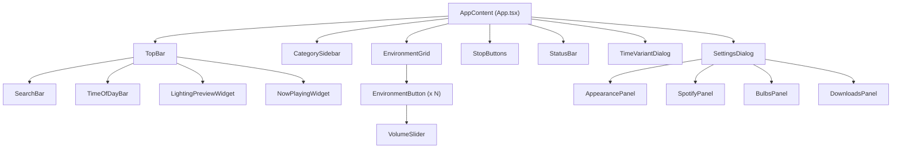
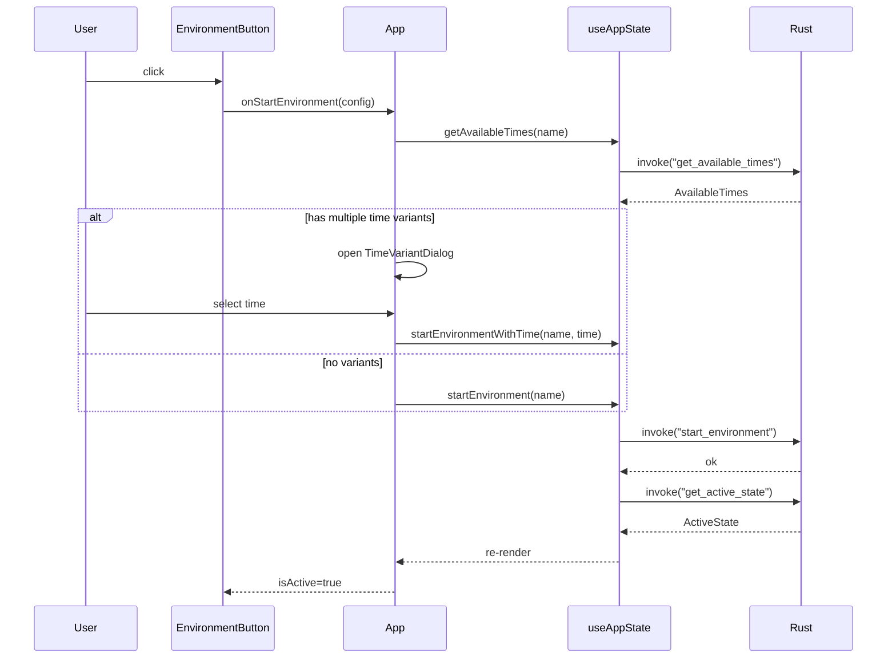

# Components

React components for the Immerse Yourself Tauri frontend. All components are functional components using TypeScript with FC typing.

## Component Hierarchy

## User Interaction Flow

## Components

### TopBar

**File:** `TopBar.tsx`

Horizontal bar at the top of the app containing the search input, time-of-day selector, lighting preview, and now-playing indicator. Includes a hamburger menu button for mobile layout.

**Props:** `searchQuery`, `onSearchChange`, `onSearchSelect`, `currentTime`, `availableTimes`, `onTimeChange`, `activeState`, `allConfigs`, `onLightsClick`, `showHamburger`, `mobileMenuOpen`, `onHamburgerClick`

**Key behavior:** Deep-merges time variant overrides into the base animation config to compute the correct lighting preview colors for the current time of day.

---

### CategorySidebar

**File:** `CategorySidebar.tsx`

Left sidebar listing all environment categories (e.g., Combat, Dungeon, Town) followed by a "SOUNDS" separator and sound categories. Shows clickable badges next to categories that have active lights or atmosphere sounds.

**Props:** `categories`, `current`, `onSelect`, `activeState`, `allConfigs`, `soundCategories`, `onLightsBadgeClick`, `onAtmosphereBadgeClick`, `onSettingsClick`

**Key behavior:**
- Displays a floating "sounds playing below" indicator when active sound categories are scrolled out of view.
- Badge clicks navigate to the category and highlight the active config.
- On mobile, an optional Settings item appears at the bottom of the list.

---

### EnvironmentGrid

**File:** `EnvironmentGrid.tsx`

Responsive grid layout that renders an `EnvironmentButton` for each environment in the current category or search results. Assigns keyboard shortcut keys (Q, W, E, R, T, Y, U, I, O, P, A, S, D, F, G, H, J, K, L) to each button by position.

**Props:** `environments`, `activeState`, `focusedIndex`, `highlightedConfig`, `onStartEnvironment`, `onToggleLoop`, `onVolumeChange`

**Key behavior:** Determines whether each config is a loop sound (toggle on/off) or a full environment (start), and dispatches to the appropriate handler.

---

### EnvironmentButton

**File:** `EnvironmentButton.tsx`

Individual button representing an environment or loop sound. Displays the environment icon as a semi-transparent background, a shortcut key badge with a deterministic pastel color, the cleaned display name, and feature badges showing which engines are enabled.

**Props:** `config`, `isActive`, `isLoopActive`, `isFocused`, `shortcutKey`, `volume`, `onVolumeChange`, `onClick`

**Key behavior:**
- Feature badges: Sound (speaker/megaphone), Spotify, Atmosphere, Lights, Loop.
- Loop sound buttons always show a `VolumeSlider`.
- Hover tooltip rendered via React portal for correct z-ordering.
- Focused state shows a green pulse animation (used by search and badge navigation).

---

### StopButtons

**File:** `StopButtons.tsx`

Footer row of three stop controls: Stop Lights, Stop Sound (with Spacebar shortcut badge), and Stop Atmosphere. Active buttons are visually highlighted.

**Props:** `onStopLights`, `onStopSounds`, `onStopAtmosphere`, `lightsActive`, `atmosphereActive`

**Keyboard shortcuts:**
- **Space** -- stops all sounds (when no input is focused)

---

### SearchBar

**File:** `SearchBar.tsx`

Text input for fuzzy searching across all environment configs. Shows a clear button when text is present.

**Props:** `value`, `onChange`, `onSelect`

**Keyboard shortcuts:**
- **Ctrl+L** -- focuses the search input and selects all text
- **Escape** -- clears the search and blurs the input
- **Enter** -- delegates to `onSelect` for two-press activation (first Enter focuses result, second activates)

---

### StatusBar

**File:** `StatusBar.tsx`

Bottom bar showing current status: active sound effect, atmosphere sounds (with count), active lights config, and download progress. Hover tooltip provides a detailed multi-section breakdown.

**Props:** `activeState`

---

### TimeOfDayBar

**File:** `TimeOfDayBar.tsx`

Four time-of-day buttons: Morning, Daytime, Afternoon, Evening. Buttons without available time variants appear blank (no icon, no label, no shortcut). "Daytime" is the default, meaning the base config with no time variant overrides.

**Props:** `currentTime`, `availableTimes`, `onTimeChange`

**Keyboard shortcuts (handled by App):**
- **1** -- Morning
- **2** -- Daytime
- **3** -- Afternoon
- **4** -- Evening

Shortcuts only activate when the corresponding time is available.

---

### NowPlayingWidget

**File:** `NowPlayingWidget.tsx`

Compact display in the top bar showing what is currently active: the lights config name and icon, atmosphere sound count, or download status. Clicking navigates to the active config's category.

**Props:** `activeLightsConfig`, `activeLightsIcon`, `activeAtmosphereCount`, `isDownloading`, `pendingDownloads`, `onLightsClick`

**Keyboard shortcut (handled by App):**
- **5** -- navigates to the active lights config

---

### LightingPreviewWidget

**File:** `LightingPreviewWidget.tsx`

Visual preview of the active lighting configuration. Renders a vertical gradient using the computed RGB colors for backdrop, overhead, and battlefield bulb groups. Resolves scene IDs to representative colors and handles `inherit_backdrop`/`inherit_overhead` references.

**Props:** `animationConfig`, `onClick`

---

### VolumeSlider

**File:** `VolumeSlider.tsx`

10-segment vertical volume control for loop sounds (range 10-100). Segments are colored on a green-to-red gradient. Click position maps to the corresponding volume level.

**Props:** `value`, `onChange`, `onClick`

---

### SettingsDialog

**File:** `SettingsDialog.tsx`

Modal dialog with four panels navigated by a left sidebar:

| Panel | Description |
|-------|-------------|
| **Appearance** | Light/Dark/System theme selection via `ThemeContext` |
| **Spotify** | API credentials (username, client_id, client_secret, redirect_uri) and startup behavior |
| **WIZ Bulbs** | Bulb IP addresses for backdrop/overhead/battlefield groups, with network discovery |
| **Downloads** | SSL certificate verification toggle for freesound.org |

**Props:** `onClose`

**Keyboard shortcuts:**
- **Escape** -- closes the dialog

Nav items show `[checkmark]` when configured and `[!]` when setup is needed.

---

### TimeVariantDialog

**File:** `TimeVariantDialog.tsx`

Modal dialog shown when an environment with multiple time variants is activated. Presents available times as large buttons with icons and shortcut numbers.

**Props:** `configName`, `availableTimes`, `currentTime`, `onSelect`, `onClose`

**Keyboard shortcuts:**
- **1-4** -- selects the corresponding time variant
- **Escape** -- closes the dialog

## Global Keyboard Shortcuts (handled by App.tsx)

| Key | Action |
|-----|--------|
| Ctrl+Q | Quit application |
| Ctrl+, | Open Settings |
| Ctrl+L | Focus search bar |
| Ctrl+PgUp/PgDn | Navigate categories |
| Q-L (letters) | Activate environment button by position |
| 1-4 | Select time of day (when available) |
| 5 | Navigate to active lights config |
| Space | Stop all sounds |
| Escape | Clear search / close dialogs |
| Enter | Activate search-focused button (two-press) |
