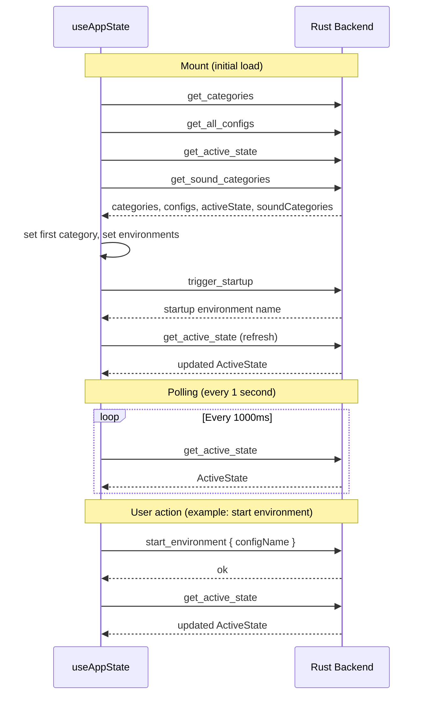

# Hooks

## useAppState

**File:** `useAppState.ts`

Central state management hook for the Immerse Yourself frontend. All communication with the Rust backend flows through this hook via Tauri's `invoke` IPC mechanism.

### Architecture

The hook owns all top-level application state and exposes it alongside action functions to the `App` component, which distributes data to child components via props. There is no external state library -- React's `useState` holds the client-side state, while the Rust backend is the authoritative source of truth.

### State Lifecycle



### Managed State

| State | Type | Description |
|-------|------|-------------|
| `categories` | `string[]` | Ordered list of category names |
| `currentCategory` | `string` | Currently selected category |
| `environments` | `EnvironmentConfig[]` | Configs for the current category |
| `allConfigs` | `Record<string, EnvironmentConfig[]>` | All configs indexed by category |
| `activeState` | `ActiveState \| null` | Live state from backend (lights, atmosphere, sound, downloads) |
| `searchQuery` | `string` | Current search input text |
| `searchResults` | `EnvironmentConfig[]` | Matching configs from backend search |
| `isLoading` | `boolean` | True until initial data load completes |
| `soundCategories` | `string[]` | Categories classified as sound-only |

### IPC Commands

| Function | Tauri Command | Description |
|----------|---------------|-------------|
| (on mount) | `get_categories` | Load ordered category list |
| (on mount) | `get_all_configs` | Load all environment configs by category |
| (on mount) | `get_active_state` | Get current active state snapshot |
| (on mount) | `get_sound_categories` | Get list of sound-only categories |
| (on mount) | `trigger_startup` | Auto-start the hidden "Startup" environment |
| `handleSearch(query)` | `search_configs` | Fuzzy search across all config metadata |
| `startEnvironment(name)` | `start_environment` | Activate an environment by name |
| `startEnvironmentWithTime(name, time)` | `start_environment_with_time` | Activate with a specific time variant |
| `getAvailableTimes(name)` | `get_available_times` | Check which time variants a config supports |
| `setCurrentTime(time)` | `set_current_time` | Update the active time of day |
| `toggleLoopSound(url)` | `toggle_loop_sound` | Start or stop a loop sound |
| `setVolume(url, volume)` | `set_volume` | Adjust volume for an atmosphere sound |
| `stopLights()` | `stop_lights` | Stop all light animations |
| `stopSounds()` | `stop_sounds` | Stop all playing sound effects |
| `stopAtmosphere()` | `stop_atmosphere` | Stop atmosphere sounds and Spotify |

### Return Value

The hook returns an object with all state values and action functions:

```typescript
{
  // Data (read-only from component perspective)
  categories: string[];
  currentCategory: string;
  environments: EnvironmentConfig[];
  allConfigs: Record<string, EnvironmentConfig[]>;
  activeState: ActiveState | null;
  searchQuery: string;
  searchResults: EnvironmentConfig[];
  isLoading: boolean;
  soundCategories: string[];

  // Setters
  setCurrentCategory: (category: string) => void;

  // Actions (async, invoke Rust backend)
  handleSearch: (query: string) => Promise<void>;
  startEnvironment: (configName: string) => Promise<void>;
  startEnvironmentWithTime: (configName: string, time: string) => Promise<void>;
  getAvailableTimes: (configName: string) => Promise<AvailableTimes>;
  setCurrentTime: (time: string) => Promise<void>;
  toggleLoopSound: (url: string) => Promise<void>;
  setVolume: (url: string, volume: number) => Promise<void>;
  stopLights: () => Promise<void>;
  stopSounds: () => Promise<void>;
  stopAtmosphere: () => Promise<void>;
}
```

### Design Notes

- **Optimistic updates**: `setVolume` updates local state immediately before the backend confirms, preventing slider lag.
- **State refresh pattern**: Most actions call `get_active_state` after the primary command completes, ensuring the UI reflects backend changes promptly.
- **Polling**: A 1-second interval keeps the UI in sync with backend state changes that occur outside of direct user actions (e.g., sound finishing playback, downloads completing).
- **Startup sequence**: On mount, the hook loads all data in parallel via `Promise.all`, then triggers the startup environment separately. The `isLoading` flag prevents rendering until initial data is ready.
