# E2E Test Suite

End-to-end testing and screenshot automation for Immerse Yourself. Launches the app, navigates the UI via the WebKit Inspector Protocol, and captures screenshots.

## Architecture

```mermaid
graph TD
    subgraph App ["Tauri Application"]
        Binary["immerse-tauri binary"]
        Inspector["WEBKIT_INSPECTOR_HTTP_SERVER<br/>HTTP listing + WebSocket"]
    end

    subgraph Protocol ["WebKit Inspector Protocol"]
        HTTP["HTTP :3030<br/>Target listing page"]
        WS["WebSocket /socket/N/N/WebPage<br/>Target multiplexer"]
        Target["Target.sendMessageToTarget<br/>→ Runtime.evaluate"]
    end

    subgraph Test ["Test Runner"]
        Local["run_local.py<br/>(make screenshot)"]
        Docker["pytest + tauri_app.py<br/>(make e2e)"]
    end

    Local --> HTTP
    Docker --> HTTP
    HTTP --> WS
    WS --> Target
    Target --> Binary
    Local -->|ImageMagick import| Screenshot["immerse_yourself_screenshot.jpg"]
    Docker -->|scrot| Screenshot2["output/*.jpg"]
```



## How It Works

1. **App launch**: The binary starts with `WEBKIT_INSPECTOR_HTTP_SERVER=127.0.0.1:3030`, which exposes an HTTP page listing debuggable targets and WebSocket endpoints.
2. **WebSocket connect**: The test connects to the `/socket/N/N/WebPage` endpoint, which is a **Target multiplexer** (not a direct page connection).
3. **Target discovery**: On connect, a `Target.targetCreated` event provides the target ID (e.g. `page-7`).
4. **JS evaluation**: All `Runtime.evaluate` calls must be wrapped in `Target.sendMessageToTarget`. Results arrive via `Target.dispatchMessageFromTarget` events.
5. **Tauri IPC**: The test calls `window.__TAURI_INTERNALS__.invoke()` to directly trigger backend commands (e.g. `start_environment_with_time`). Since `awaitPromise` doesn't work through the Target proxy, async results are polled via a global variable.
6. **Screenshot**: Window-specific capture using ImageMagick `import` (local) or `scrot` (Docker).

## Files

| File | Description |
|------|-------------|
| `run_local.py` | Local screenshot runner (used by `make screenshot`, no Docker needed) |
| `tauri_app.py` | `TauriApp` helper class for app control (inspector + keyboard fallback) |
| `test_screenshots.py` | pytest screenshot test: Travel > Afternoon |
| `conftest.py` | pytest fixtures |
| `Dockerfile` | Multi-stage Docker build for CI |
| `docker-compose.yml` | Docker orchestration with output volume mount |
| `run.sh` | Container entrypoint: starts D-Bus, PulseAudio, Xvfb, then runs pytest |
| `requirements.txt` | Python dependencies (pytest, websockets) |
| `output/` | Screenshot output directory |

## Usage

From the project root:

```bash
# Capture the project screenshot locally (Travel > Afternoon)
make screenshot

# Build the Docker image (for CI or Docker-based tests)
make e2e-build

# Run all E2E tests in Docker
make e2e
```

`make screenshot` runs `run_local.py` directly on the host, captures the app window, and saves to `immerse_yourself_screenshot.jpg` in the project root.

## Test Flow (Travel > Afternoon)

| Step | Action | Method |
|------|--------|--------|
| 1 | Launch app with inspector | `WEBKIT_INSPECTOR_HTTP_SERVER=127.0.0.1:3030` |
| 2 | Connect WebSocket | `/socket/N/N/WebPage`, discover target ID |
| 3 | Wait for UI | Poll `document.querySelector('.category-list')` |
| 4 | Click Travel category | JS click via `Target.sendMessageToTarget` |
| 5 | Start Travel + Afternoon | Tauri IPC `start_environment_with_time` |
| 6 | Verify state | Poll `.now-playing-status` for "Travel" |
| 7 | Capture screenshot | `import -window <wid>` (window-specific) |

## Docker Build Details

### Stage 1 -- Builder

- **Base**: `ubuntu:24.04`
- **Rust**: 1.89 from Ubuntu apt repos (`cargo-1.89`, `rustc-1.89`)
- **Node.js**: Ubuntu default (18.x)
- **Tauri feature**: `devtools` enabled via sed (for WebKit Inspector support in release builds)
- **Build**: `cargo-tauri build --no-bundle`

### Stage 2 -- Runtime

- **Base**: `ubuntu:24.04`
- **Runtime deps**: `libwebkit2gtk-4.1-0`, `libgtk-3-0`, `xvfb`, `xdotool`, `scrot`, `pulseaudio`, `dbus-x11`
- **Python**: 3.12 with pytest and websockets
- **Fonts**: DejaVu, Liberation, Noto Color Emoji (for proper UI rendering)

## Writing New Tests

Add test functions to `test_screenshots.py` or create new test files:

```python
def test_my_scenario(app):
    app.start(maximize=True)
    app.wait(app.STARTUP_WAIT)
    app.connect_inspector()

    # Navigate using keyboard shortcuts
    app.click_category("combat")
    app.wait(app.ACTION_WAIT)
    app.click_environment("Battle Dungeon")
    app.wait(app.ENVIRONMENT_WAIT)

    app.screenshot("/output/my_screenshot.jpg")
```

The `TauriApp` class provides:

- `start(maximize)` -- Launch the app with inspector enabled
- `connect_inspector()` -- Connect WebSocket and discover target ID
- `evaluate_js(expr)` -- Execute JS via `Target.sendMessageToTarget`
- `invoke_tauri(command, args)` -- Call Tauri IPC (polling-based for async)
- `click_category(name)` -- Navigate to a sidebar category
- `click_environment(name)` -- Click an environment button by display name
- `select_time_variant(label)` -- Select a time variant from the dialog
- `wait_for_element(selector)` -- Wait for a CSS selector to appear
- `wait_for_text(selector, expected)` -- Wait for element text to match
- `get_element_text(selector)` -- Get element text content
- `log_debug_state()` -- Print current UI state for debugging
- `screenshot(path)` -- Capture a screenshot (minimizes inspector windows first)
- `send_key(key)` -- Send a keystroke via xdotool

## Troubleshooting

### Build fails with "permission denied"
The Makefile auto-detects Docker socket permissions and uses `sudo` if needed. If it still fails, add your user to the docker group: `sudo usermod -aG docker $USER` and re-login.

### Screenshot shows blank/black screen
Increase `STARTUP_WAIT` in `tauri_app.py`. The app needs time to load configs and render the UI.

### Wrong environment button clicked
Environment buttons are assigned shortcut keys Q-P in alphabetical order. If new configs are added to a category, the keyboard mapping in `tauri_app.py` (`CATEGORY_ENVS`) needs updating.
